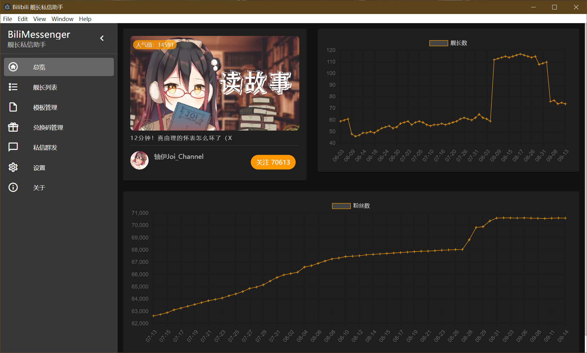

# BiliMessenger

> Bilibili 舰长私信群发助手



## Build Setup

``` bash
# install dependencies
npm install

# serve with hot reload at localhost:9080
npm run dev

# build electron application for production
npm run build


# lint all JS/Vue component files in `src/`
npm run lint
```

## Thanks


